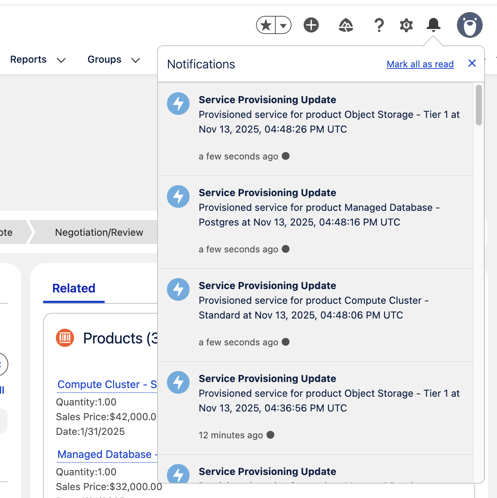

# Callback Integrations with Heroku AppLink

This service-provisioning use case demonstrates a complete Heroku AppLink integration with Salesforce via Apex, featuring an asynchronous workflow that provisions external services for Opportunity line items—in this case, the line items represent cloud services being sold—and reports status back to Salesforce through callbacks.



## Overview

This project showcases how to integrate Salesforce with Node.js code running on Heroku using Heroku AppLink, enabling Apex code to securely request provisioning of external compute and data services for selected Opportunities. The integration focuses exclusively on an asynchronous processing pattern: Salesforce submits provisioning jobs, Heroku defers the work to an async thread (using `setImmediate`), and callback notifications update Salesforce and generate user-facing notifications.

> **Note:** For production workloads, you may prefer to use a dedicated Heroku Worker process instead of processing work in an async thread within the web process. A variant of this sample that demonstrates the worker pattern can be found at [applink-apex-integration](https://github.com/afawcett/applink-apex-integration).

## Prerequisites

- Node.js 20.x
- Salesforce CLI (`sf`)
- Heroku CLI
- Heroku AppLink CLI plugin installed (`heroku plugins:install applink`)
- Dev Hub org configured with scratch org creation permissions

## Local Development and Testing

This section covers setting up a local development environment to test the provisioning API before deploying to production. You'll create a Salesforce scratch org, run the Node.js web process locally, and exercise the asynchronous `/api/provisionServices` endpoint using the provided tools. The `invoke.sh` script automatically creates the AppLink HTTP headers needed for local testing, so no Heroku setup is required.

> **Note:** Callbacks will not work in local testing mode, so you won't see Salesforce notifications. However, you can validate the provisioning logic by monitoring the web process logs to see job processing and service provisioning messages.

### Salesforce Setup
```bash
# Create a new scratch org (and set as default)
sf org create scratch --definition-file config/project-scratch-def.json --alias my-org --set-default

# Import sample data using the data script (no metadata deploy needed for local testing)
./bin/data.sh

# Deploy the developer permission set (required for session-based permission set activation in invoke.sh)
sf project deploy start --target-org my-org --metadata PermissionSet:ProvisioningServiceDeveloper

# Assign the developer permission set to your user
sf org assign permset --name ProvisioningServiceDeveloper --target-org my-org
```

### Running Locally
```bash
# Install dependencies
npm install

# Run the web process locally
npm start
# Or use: node src/server/index.js

# The provisioning API will be available at http://localhost:5000
# Swagger docs at http://localhost:5000/docs
```

### Testing the API

With the local server running, you can invoke the asynchronous provisioning workflow through the `/api/provisionServices` endpoint. First, capture Opportunity IDs to include in the request:
```bash
# Get opportunity IDs from your org
sf data query --query "SELECT Id, Name, Amount, CloseDate FROM Opportunity LIMIT 5"
```

Next, submit a provisioning job using the helper script (the script automatically generates AppLink HTTP headers from your Salesforce org credentials):
```bash
# Submit a provisioning job for one or more opportunities
# The fourth parameter activates the ProvisioningServicePermissions session-based permission set
# This elevates permissions to read custom metadata records (ProvisioningParameter__mdt) that the user doesn't normally have access to
./bin/invoke.sh my-org http://localhost:5000/api/provisionServices '{"opportunityIds": ["006XXXXXXXXXXXXXXX"]}' ProvisioningServicePermissions
```

This will:
1. Send a provisioning request to the local API with AppLink headers (automatically generated by `invoke.sh`)
2. Return a `201` response containing the provisioning job ID
3. Process provisioning directly in the API handler (callbacks will not execute in local mode, but you can see processing in the logs)

**Expected Output:**
```json
{
  "jobId": "f945be1b-94f8-4562-8797-ba877bba3d01"
}
```

Monitor the server logs to see the job processing:
```bash
# In your server terminal, you should see:
Processing provisioning job f945be1b-94f8-4562-8797-ba877bba3d01 for 1 opportunity IDs
Processing 1 Opportunities for provisioning
Provisioning job f945be1b-94f8-4562-8797-ba877bba3d01 completed. 3 services provisioned.
```


## Deployment

This section covers deploying the provisioning API to Heroku using Heroku AppLink. You'll create a Salesforce scratch org, deploy the Node.js application to Heroku, configure the AppLink integration, and finally deploy the Salesforce components and code. This creates a working system where Salesforce can securely initiate service provisioning jobs.

### Salesforce Setup
```bash
# Create a new scratch org (and set as default)
sf org create scratch --definition-file config/project-scratch-def.json --alias my-org --set-default

# Import sample data using the data script
./bin/data.sh

# Deploy the ManageHerokuAppLink permission set (required for Heroku CLI commands)
sf project deploy start --metadata PermissionSet:ManageHerokuAppLink

# Assign the ManageHerokuAppLink permission set to your user
sf org assign permset --name ManageHerokuAppLink

# Generate password for the scratch org admin user (needed for Heroku connection)
sf org generate password
```

### Deploy to Heroku
```bash
# Create Heroku app
heroku create

# Add Heroku AppLink addon
heroku addons:create heroku-applink --wait

# Add required buildpacks
heroku buildpacks:add --index=1 heroku/heroku-applink-service-mesh
heroku buildpacks:add heroku/nodejs

# Set Heroku app ID
heroku config:set HEROKU_APP_ID="$(heroku apps:info --json | jq -r '.app.id')"

# Deploy code
git push heroku main

# Connect to Salesforce org
heroku salesforce:connect my-org -l https://test.salesforce.com

# Publish API to Salesforce
heroku salesforce:publish api-docs.yaml --client-name ProvisioningService --connection-name my-org

# Assign Permission Sets to allow your user to invoke the Heroku code
sf org assign permset --name ProvisioningService
sf org assign permset --name ProvisioningServicePermissions
```

### Deploy Salesforce Metadata
```bash
# Now deploy the Salesforce components and code (after Heroku is ready)
sf project deploy start
```

### Verify Deployment
Confirm the app has started:
```bash
heroku logs --tail
```

Navigate to your org's **Setup** menu and search for **Heroku** then click **Apps** to confirm your application has been imported.

### Verify AppLink Integration
Test that Apex can successfully call the Heroku service:
```bash
sf apex run --file scripts/apex/AppLinkTest.apex
```

This script will:
- Call the provisioning service via the AppLink stubs
- Display the response data structure returned from the initial request
- Confirm the service integration is working correctly
- Show provisioning job submission details and background processing
- Trigger the `ProvisioningCallback` Apex callback handler class when provisioning completes

After the provisioning job completes (approximately 30 seconds for 3 services), the callback will execute and the `ProvisioningCallback` class will send custom notifications to your Salesforce user. Look for "Service Provisioning Update" notifications in your Salesforce notifications panel, similar to those shown in the screenshot at the top of this README.

**Expected Output:**
```
=== Testing ProvisioningService asynchronous operation ===
Testing with Opportunity: Sample Opportunity 1 (ID: 006XXXXXXXXXXXXXXX)
ProvisioningService stub created successfully.
Provisioning request prepared with 1 opportunity ID(s).
Invoking provisioning service asynchronously...
SUCCESS: provisionServices accepted the job.
   Job ID: f945be1b-94f8-4562-8797-ba877bba3d01
   Response Code: 201
   Invocation ID: 08PXXXXXXXXXXXXXXX
=== Provisioning call complete ===
```

**Note:** Job IDs and invocation IDs will be different each time. If you see authentication errors (401), ensure the `ProvisioningService` permission set is assigned to your user.

## Project Structure

This project contains both Salesforce code and Heroku code deployed via the CLI commands above.

```
applink-apex-integration/
├── bin/                        # Various tools for data creation and local development
├── config/
│   └── project-scratch-def.json
├── data/
│   ├── accounts.json
│   ├── opportunities.json
│   └── import-plan.json
├── scripts/                    # Apex test scripts (e.g., AppLinkTest.apex)
├── src/                        # Heroku/Node.js source code
│   ├── routes/api.js
│   ├── services/provisionServices.js
│   └── ...
├── src.org/                    # Salesforce metadata
│   └── main/default/
│       ├── classes/
│       │   ├── ProvisionServicesController.cls
│       │   └── ProvisioningCallback.cls
│       ├── notificationtypes/Service_Provisioning_Update.notiftype-meta.xml
│       ├── pages/ProvisionServices.page
│       └── objects/Opportunity/
│           ├── layouts/
│           ├── listViews/
│           └── webLinks/ProvisionServices.webLink-meta.xml
├── sfdx-project.json           # Salesforce project configuration
└── README.md
```

## Configuration for Heroku App Async Callbacks

In order to get Heroku AppLink to generate the callback interface, you need to make certain configurations in the OpenAPI specification, which is a document needed by Heroku AppLink to describe your Heroku code to the rest of the Salesforce Platform. If your not familiar with OpenAPI don't worry, most languages these days have frameworks that will generate this from your code, all be it with a little extra annotations from you. This is the approach I took in the sample used in this sample - so what you see below is generated OpenAPI schema just for illustration purposes.

Here's a sample of the `api-docs.yaml` showing how callbacks are configured for asynchronous service provisioning:

```yaml
openapi: 3.0.1
info:
  title: Provisioning API
  version: 1.0.0

paths:
  /api/provisionServices:
    post:
      operationId: provisionServices
      summary: Submit Provisioning Job
      requestBody:
        content:
          application/json:
            schema:
              $ref: "#/components/schemas/ProvisionServicesRequest"
      responses:
        "201":
          description: Provisioning request accepted
          content:
            application/json:
              schema:
                $ref: "#/components/schemas/ProvisionServicesResponse"
      callbacks:
        provisioningStatus:
          "{$request.body#/callbackUrl}":
            post:
              description: Callback with provisioning status per requested service
              operationId: provisioningStatusCallback
              requestBody:
                content:
                  application/json:
                    schema:
                      type: object
                      properties:
                        jobId:
                          type: string
                        opportunityIds:
                          type: array
                          items:
                            type: string
                        services:
                          type: array
                          items:
                            type: object
                            properties:
                              serviceId:
                                type: string
                              opportunityId:
                                type: string
                              lineItemId:
                                type: string
                              productReference:
                                type: string
                              status:
                                type: string
                              message:
                                type: string
                        summary:
                          type: object
                          properties:
                            total:
                              type: integer
                            succeeded:
                              type: integer
                            failed:
                              type: integer
                        status:
                          type: string
                        errors:
                          type: array
                          items:
                            type: string
              responses:
                "200":
                  description: Provisioning callback received successfully

components:
  schemas:
    ProvisionServicesRequest:
      type: object
      required:
        - opportunityIds
      properties:
        opportunityIds:
          type: array
          items:
            type: string
        callbackUrl:
          type: string
    ProvisionServicesResponse:
      type: object
      required:
        - jobId
      properties:
        jobId:
          type: string
```

Key points about the callback configuration:

- **`callbacks` section**: Defines the callback interface that Salesforce will implement
- **`provisioningStatus`**: The callback name that identifies this specific callback scenario
- **`{$request.body#/callbackUrl}`**: Dynamic callback URL from the request body
- **Callback schema**: The `ProvisioningServiceResult` schema defines what data Salesforce will send back
- **Response codes**: Standard HTTP response codes for the callback endpoint

**Note:** The `/bin/apidocgen.sh` script automates the generation of OpenAPI documentation with proper callback handling for Heroku AppLink integration. It starts the local server, downloads the YAML, converts `x-callbacks` to `callbacks` (required for AppLink), and cleans up automatically. The script handles a limitation in the Swagger framework used by the project, which doesn't yet support the official `callbacks` field. Instead, the framework generates `x-callback` entries as custom extensions, which are then post-processed and renamed to the official OpenAPI `callbacks` format required by Heroku AppLink.

## Monitoring and Other Considerations

Under the covers Heroku AppLink uses a special "Heroku mode" built into External Services. This lets the integration leverage all present and future External Services capabilities. External Services generates the Apex stubs, tracks the job lifecycle, and manages callback delivery. Use standard objects such as `BackgroundOperation` to monitor provisioning work and status. The callback window lasts 24 hours; if your workload might exceed that, plan for a fallback (for example, emit a platform event that triggers the same Apex handler, albeit outside the original user context).

### Other Notes

- The `api-docs.yaml` file contains the OpenAPI schema that defines the provisioning API endpoints and callbacks. This schema is required for AppLink integration.
- The provisioning logic is implemented in the `provisionServices.js` source file under `src/server/services`.
- This Node.js implementation uses asynchronous processing directly in the API handler.
- The [@heroku/applink](https://www.npmjs.com/package/@heroku/applink) package is used to simplify API communications with the org.
- Source code for configuration/metadata deployed to Salesforce can be found in the `/src.org` directory.
- Per **Heroku AppLink** documentation, the service mesh buildpack must be installed to enable authenticated connections to be intercepted and passed through to your code.
- The `/bin/data.sh` script automates the import of sample data into your scratch org. It handles the data import process using the import plan and sample data files in the `data/` directory. This script should be run from the project root directory and will automatically import accounts, opportunities, and related data needed for testing the provisioning functionality.
- The `/bin/apexstubs.sh` tool extracts dynamically generated Apex classes from Salesforce External Services and AppLink integrations. It downloads the Apex code with proper formatting and indentation as seen in the Salesforce UI. This is particularly useful for AI coding assistants like Cursor, which can better understand how to create Apex code that uses the generated stubs when they have access to the properly formatted class definitions.

### ApexStubs Tool Usage

The ApexStubs tool extracts dynamically generated Apex classes from any Salesforce External Services or AppLink integration. It requires authentication to access your Salesforce org. You have two options depending on your org type:

#### For Scratch Orgs:
```bash
# Generate a password for the scratch org admin user
sf org generate password

# Then run the ApexStubs tool
./bin/apexstubs.sh
```

#### For Non-Scratch Orgs:
```bash
# Set the SF_PASSWORD environment variable
export SF_PASSWORD='your-org-password'

# Then run the ApexStubs tool
./bin/apexstubs.sh

# Or run with password inline
SF_PASSWORD='your-org-password' ./bin/apexstubs.sh
```

**Note:** The tool will automatically handle the authentication and download the dynamically generated Apex classes to the `bin/apexstubs/downloads/` directory.

### Debugging Callback Issues

For debugging callback issues, you can query the `BackgroundOperation` object to see the status of asynchronous operations and any error messages:

```bash
# Query recent background operations
sf data query --query "SELECT Id, Status, Error, Type, StartedAt, FinishedAt FROM BackgroundOperation WHERE CreatedDate > 2025-08-19T00:00:00.000Z ORDER BY CreatedDate DESC LIMIT 10"

# Query only failed operations
sf data query --query "SELECT Id, Status, Error, Type, StartedAt, FinishedAt FROM BackgroundOperation WHERE Status = 'Error' ORDER BY CreatedDate DESC LIMIT 5"

# Check for failed callback operations specifically
sf data query --query "SELECT Id, Status, Error, Type FROM BackgroundOperation WHERE Type = 'ExternalServiceCallback' AND Status = 'Error' ORDER BY CreatedDate DESC LIMIT 5"
```

**Error field contents:** The `Error` field contains detailed error messages from Salesforce when callbacks fail.

**Common callback errors:** Look for "Invalid Apex callback type" errors which may indicate Salesforce platform issues.

## Components

### 1. Provision Services Visualforce Page (`ProvisionServices`)
- **Type**: Visualforce Page with `StandardSetController`
- **Purpose**: Allows list-view selection of Opportunities to initiate provisioning
- **Functionality**: Invokes the AppLink provisioning service and displays status messages
- **Usage**: Attached to the Opportunity list view button

### 2. Provision Services List Button (`ProvisionServices`)
- **Type**: Opportunity list view button
- **Purpose**: Launches the `ProvisionServices` Visualforce page for selected Opportunities
- **Status**: Added to Opportunity list views during metadata deployment

## Sample Data

The project includes sample data for testing:

**10 Sample Accounts:**
- Various industries (Technology, Manufacturing, Healthcare, etc.)
- Different types (Customer, Prospect)
- Geographic diversity across US states

**10 Sample Opportunities:**
- Different stages (Prospecting, Qualification, Proposal, etc.)
- Various amounts ($25K - $200K)
- Different lead sources (Web, Cold Call, Partner Referral)
- Line items that can be treated as provisionable services

## Troubleshooting

### Data Import Issues
- Run the data import script from the project root: `./bin/data.sh`
- Verify the plan file format matches the schema exactly
- Check that the scratch org is properly authenticated

### Deployment Issues
- Run `sf project deploy start` to deploy all metadata at once
- Check for any validation errors in the deployment output
- Ensure all required dependencies are included in the project

### AppLink Integration Issues
- **Buildpack errors:** Ensure service mesh buildpack is first
- **Permission errors:** Verify ManageHerokuAppLink permission set is assigned
- **AppLink credential errors:** Ensure both `ProvisioningService` and `ProvisioningServicePermissions` permission sets are assigned
- **Connection failures:** Check scratch org is active and accessible
- **API publish errors:** Ensure OpenAPI schema is valid and accessible
- **Test failures:** Run `AppLinkTest.apex` to verify integration is working
