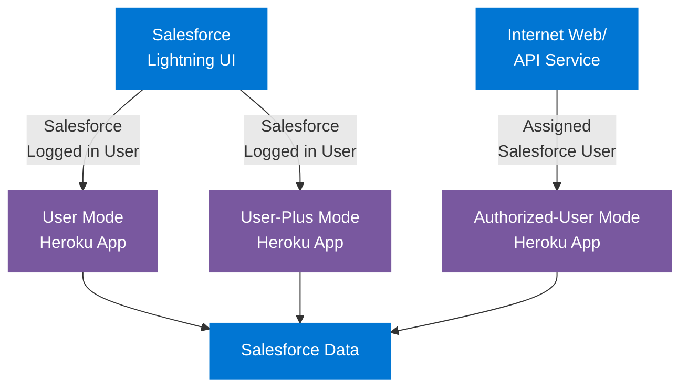

# Heroku AppLink Authentication Modes

## Authentication Modes

### User Mode
- **Integration Type**: Salesforce UI with Salesforce User
- **Flow**: Salesforce → Heroku
- **Context**: Logged-in Salesforce user's permissions
- **Setup**: Assign permission set to gate access

### User-Plus Mode
- **Integration Type**: Salesforce UI with Salesforce User
- **Flow**: Salesforce → Heroku
- **Context**: Logged-in Salesforce user + session-based permission elevation
- **Setup**: Assign permission set + activate session-based permission set

### Authorized-User Mode
- **Integration Type**: Non-Salesforce API/Experience
- **Flow**: Heroku → Salesforce
- **Context**: Pre-authenticated user (not the logged-in Salesforce user)
- **Setup**: Configure authorized user(s) with alias(es) beforehand

